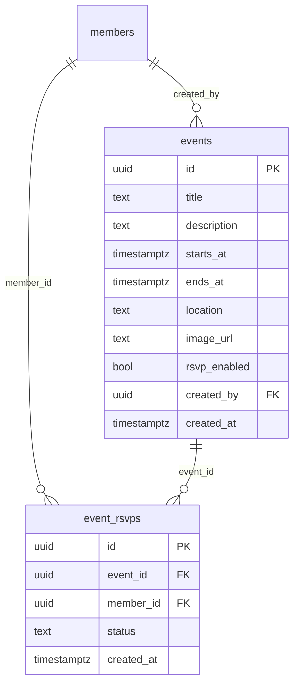

# feat: Events & RSVP System

## Overview

Move social events from Sanity CMS into Supabase and build a full in-app RSVP system. Admins manage events from `/admin`. Members RSVP directly in the calendar event modal and can see the attendee list. Admins can view and remove RSVPs per event.

Sanity's `socialEvent` schema will be deprecated after migration.

---

## Problem Statement

- Events can only be created/edited in Sanity Studio (`/studio`) — there's no in-app management
- RSVP is a dead `rsvpUrl` field pointing to Eventbrite/Google Forms — no native tracking
- Members have no way to see who else is attending
- Admins cannot manage attendance from the app

---

## Proposed Solution

Move events entirely into Supabase. This gives us:
- A single data source (no cross-system joins)
- Full admin CRUD from `/admin` without needing Studio
- Native RSVP tracking with `event_rsvps` table linked by UUID
- RLS for member-scoped reads/writes

---

## Database Schema

### `events` table

```sql
create table events (
  id          uuid primary key default gen_random_uuid(),
  title       text not null,
  description text,
  starts_at   timestamptz not null,
  ends_at     timestamptz,
  location    text,
  image_url   text,
  rsvp_enabled boolean not null default true,
  created_by  uuid references members(id) on delete set null,
  created_at  timestamptz not null default now()
);
```

### `event_rsvps` table

```sql
create table event_rsvps (
  id         uuid primary key default gen_random_uuid(),
  event_id   uuid not null references events(id) on delete cascade,
  member_id  uuid not null references members(id) on delete cascade,
  status     text not null check (status in ('going', 'not_going')),
  created_at timestamptz not null default now(),
  unique (event_id, member_id)
);
```

### RLS Policies

**events:**
- `select` → all authenticated members
- `insert` / `update` / `delete` → admins only (via `exists (select 1 from members where id = auth.uid() and is_admin = true)`)

**event_rsvps:**
- `select` → all authenticated members (members can see who is going)
- `insert` / `update` → member can upsert their own row (`member_id = auth.uid()`)
- `delete` → own row OR admin

### ERD



---

## Implementation Phases

### Phase 1 — Database & Data Layer

**Migration files:**

- `supabase/migrations/20260316000000_events.sql` — create `events` table with RLS
- `supabase/migrations/20260316000001_event_rsvps.sql` — create `event_rsvps` table with RLS

**New type definitions** in `lib/supabase/types.ts`:

```typescript
export type Event = {
  id: string
  title: string
  description: string | null
  starts_at: string
  ends_at: string | null
  location: string | null
  image_url: string | null
  rsvp_enabled: boolean
  created_by: string | null
  created_at: string
}

export type EventRsvp = {
  id: string
  event_id: string
  member_id: string
  status: 'going' | 'not_going'
  created_at: string
}

export type EventRsvpWithMember = EventRsvp & {
  members: { full_name: string; email: string } | null
}
```

**New query files:**

`lib/supabase/queries/events.ts`
```typescript
getEventsForMonth(month: Date): Promise<Event[]>
getAllUpcomingEvents(): Promise<Event[]>   // replaces Sanity version, next 10
getAdminEvents(): Promise<Event[]>         // all events, ordered starts_at desc
createEvent(data: CreateEventInput): Promise<Event>
updateEvent(id: string, data: UpdateEventInput): Promise<Event>
deleteEvent(id: string): Promise<void>
```

`lib/supabase/queries/event-rsvps.ts`
```typescript
getMemberRsvpsForEvents(memberId: string, eventIds: string[]): Promise<EventRsvp[]>
getRsvpsForEvent(eventId: string): Promise<EventRsvpWithMember[]>
upsertRsvp(eventId: string, memberId: string, status: 'going' | 'not_going'): Promise<void>
deleteRsvp(eventId: string, memberId: string): Promise<void>   // admin use
getRsvpCounts(eventId: string): Promise<{ going: number }>
```

Export both from `lib/supabase/queries/index.ts`.

**Validation schema** `lib/validations/event.ts`:
```typescript
export const createEventSchema = z.object({
  title: z.string().min(1),
  description: z.string().optional(),
  starts_at: z.string().datetime(),
  ends_at: z.string().datetime().optional(),
  location: z.string().optional(),
  image_url: z.string().url().optional().or(z.literal('')),
  rsvp_enabled: z.boolean().default(true),
})
export type CreateEventInput = z.infer<typeof createEventSchema>
```

**Validation schema** `lib/validations/rsvp.ts`:
```typescript
export const rsvpSchema = z.object({
  event_id: z.string().uuid(),
  status: z.enum(['going', 'not_going']),
})
export type RsvpInput = z.infer<typeof rsvpSchema>
```

---

### Phase 2 — Replace Calendar Data Source

**Update `app/(member)/calendar/page.tsx`:**
- Replace `getSocialEvents()` (Sanity) with `getEventsForMonth()` (Supabase)
- Pre-fetch current user's RSVPs for all returned event IDs
- Pass `userRsvps: EventRsvp[]` down to the calendar client

**Update `app/(member)/calendar/calendar-client.tsx`:**
- Change `SocialEvent[]` → `Event[]` throughout
- Replace client-side Sanity fetch (`sanityClient.fetch(...)`) with a new Route Handler or Server Action `fetchEventsForMonth(month)` that reads from Supabase
- Pass `userRsvps` into `EventModal`
- On RSVP toggle, optimistically update local `userRsvps` state

**New Route Handler or Server Action `app/(member)/calendar/actions.ts`:**
```typescript
'use server'
export async function fetchEventsForMonthAction(month: string): Promise<{ data?: Event[]; error?: string }>
export async function upsertRsvpAction(input: RsvpInput): Promise<{ error?: string }>
```

**Update `components/bulletin/upcoming-events.tsx`:**
- Replace `getAllUpcomingEvents()` (Sanity) with Supabase version
- `UpcomingEvent` type changes from `SocialEvent` to `Event` — update date field from `.date` to `.starts_at`

---

### Phase 3 — Event Modal RSVP UI

**Update `components/calendar/event-modal.tsx`:**

New props:
```typescript
type Props = {
  event: Event | null
  onClose: () => void
  userRsvpStatus: 'going' | 'not_going' | null  // null = hasn't RSVPd
  rsvpCount: number
  attendees: { full_name: string }[]             // first names only for display
}
```

RSVP section (replaces external `rsvpUrl` button):

```
[ Going (12) ]   or   [ Can't make it ]

Going: Jane S., Mike T., Sarah K. +9 more
```

- Show RSVP button only when `event.rsvp_enabled === true`
- Button toggles between "Going" (navy fill) and "Can't make it" (outline)
- Clicking either calls `upsertRsvpAction` and updates parent state
- Show attendee first names (truncate at 5, show "+N more")
- Loading state on the button during transition

---

### Phase 4 — Admin Events Management

**Add `'events'` tab to the admin panel.**

**`app/(admin)/admin/admin-client.tsx` changes:**
- Add `'events'` to `Tab` union
- Add `{ id: 'events', label: 'Events' }` to `tabs` array
- Add `<EventsTab />` conditional render block
- Pass `events: Event[]` and `eventRsvps: Record<string, EventRsvpWithMember[]>` in `Props`

**`EventsTab` component (in admin-client.tsx):**

Two sub-sections:

1. **Create Event form** — fields: Title, Date & Time (starts_at), End Time (ends_at, optional), Location, Description, Image URL, RSVP Enabled toggle. On submit calls `createEventAction`.

2. **Events list table** — columns: Date, Title, Location, RSVPs (count), Actions (Edit / Delete). Clicking an event row expands an RSVP attendee list inline.

**Admin RSVP management:** Within the expanded event row, show a table of members who RSVPd (`going` only) with a "Remove" button per row that calls `removeRsvpAction`.

**New server actions in `app/(admin)/admin/actions.ts`:**
```typescript
export async function createEventAction(fd: FormData): Promise<{ error?: string; success?: string }>
export async function updateEventAction(id: string, fd: FormData): Promise<{ error?: string; success?: string }>
export async function deleteEventAction(id: string): Promise<{ error?: string; success?: string }>
export async function removeRsvpAction(eventId: string, memberId: string): Promise<{ error?: string; success?: string }>
```

**Update `app/(admin)/admin/page.tsx`:**
- Fetch `getAdminEvents()` server-side
- Pass events to `AdminClient`

---

### Phase 5 — Deprecate Sanity Events

- Remove `socialEvent` from `sanity/schemaTypes/index.ts`
- Remove `socialEvent` from `sanity/structure.ts`
- Delete `sanity/schemaTypes/social-event.ts`
- Remove `getSocialEvents`, `getAllUpcomingEvents` from `lib/sanity/queries.ts`
- Remove `SocialEvent` type from `lib/sanity/types.ts`
- Remove `rsvpUrl`-related imports from `event-modal.tsx`

> **Note:** Only do this after Phase 2 is verified working. Keep Sanity events read-only in the interim.

---

## Acceptance Criteria

### Member Experience
- [ ] Calendar shows events from Supabase (not Sanity)
- [ ] Clicking an event with `rsvp_enabled = true` shows RSVP button
- [ ] Member can toggle "Going" / "Can't make it"
- [ ] RSVP state persists on page refresh
- [ ] Attendee names visible in the modal (going members only)
- [ ] Dashboard upcoming events sidebar still works

### Admin Experience
- [ ] Events tab visible in `/admin`
- [ ] Admin can create a new event with all fields
- [ ] Admin can delete an event (with confirmation)
- [ ] Admin can view RSVPs per event
- [ ] Admin can remove a member's RSVP

### Data Integrity
- [ ] One RSVP per member per event (unique constraint enforced)
- [ ] Deleting an event cascades to remove all RSVPs
- [ ] RLS: members cannot see RSVPs for other members' `not_going` status (only `going` visible publicly — or all visible, decide before implementing)
- [ ] Only admins can create/edit/delete events

---

## System-Wide Impact

### Files Modified
| File | Change |
|---|---|
| `lib/supabase/types.ts` | Add `Event`, `EventRsvp`, `EventRsvpWithMember` |
| `lib/supabase/queries/index.ts` | Barrel export new query files |
| `app/(member)/calendar/page.tsx` | Switch data source to Supabase |
| `app/(member)/calendar/calendar-client.tsx` | Replace Sanity fetch with Supabase action |
| `components/calendar/event-modal.tsx` | Add RSVP UI, change `SocialEvent` → `Event` |
| `components/bulletin/upcoming-events.tsx` | Switch data source |
| `app/(admin)/admin/page.tsx` | Fetch events server-side |
| `app/(admin)/admin/admin-client.tsx` | Add Events tab |
| `app/(admin)/admin/actions.ts` | Add event/RSVP actions |

### Files Created
| File | Purpose |
|---|---|
| `supabase/migrations/20260316000000_events.sql` | Events table + RLS |
| `supabase/migrations/20260316000001_event_rsvps.sql` | RSVPs table + RLS |
| `lib/supabase/queries/events.ts` | Event queries |
| `lib/supabase/queries/event-rsvps.ts` | RSVP queries |
| `lib/validations/event.ts` | Event Zod schema |
| `lib/validations/rsvp.ts` | RSVP Zod schema |
| `app/(member)/calendar/actions.ts` | Member calendar server actions |

### Files Deleted (Phase 5)
| File | Reason |
|---|---|
| `sanity/schemaTypes/social-event.ts` | Replaced by Supabase |

---

## Risks & Considerations

- **Image uploads**: The `image_url` field is a plain text URL. Admins paste a URL — no file upload UI. This is intentional to keep scope manageable. Can add Supabase Storage upload later.
- **Attendee privacy**: Decide whether `not_going` RSVPs should be visible to other members or only admins. Recommendation: only show `going` to members; admins see all.
- **Calendar month navigation**: The client-side Sanity fetch currently runs on the browser. The replacement Supabase fetch needs to go through a Server Action (not direct DB call from browser). Use `'use server'` action or a Route Handler at `/api/events?month=YYYY-MM`.
- **Existing Sanity events**: Any events in Sanity will stop appearing after Phase 2. Re-enter them manually via the new admin Events tab before switching data sources.

---

## References

- Admin tab pattern: `app/(admin)/admin/admin-client.tsx:27` (Tab union)
- Server action pattern: `app/(admin)/admin/actions.ts:18` (requireAdmin helper)
- Migration pattern: `supabase/migrations/20260311000002_blackout_periods.sql`
- Query pattern: `lib/supabase/queries/bookings.ts`
- Event modal: `components/calendar/event-modal.tsx`
- Upcoming events: `components/bulletin/upcoming-events.tsx`
